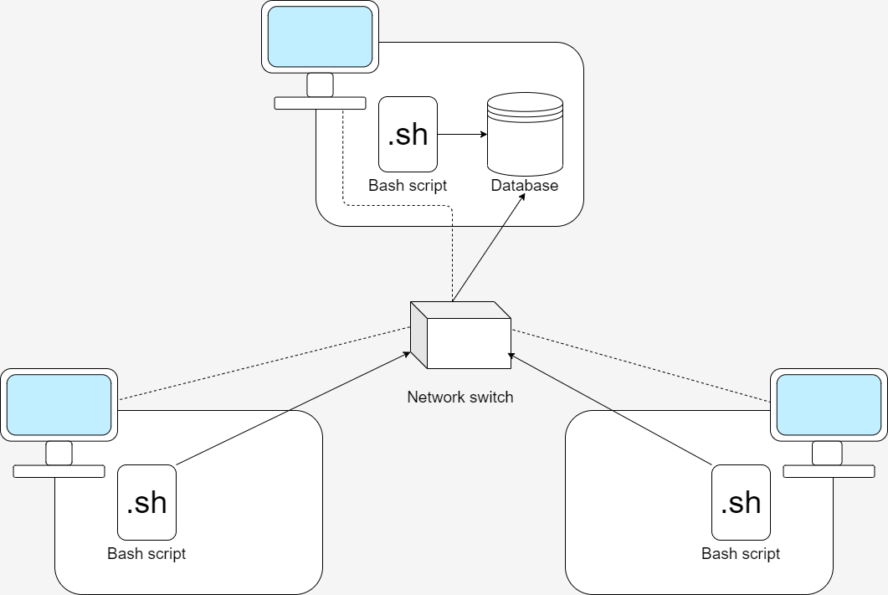

# Linux Cluster Monitoring Agent 
# Introduction
This project is a simulation of a real-time hardware monitoring agent. 
It consists of 3 bash scripts and 2 SQL files that collectively provision a Docker container running a PostgreSQL image and populate a database with host hardware information and real-time host usage data updated automatically via a crontab job. The information in the database can then be queried to draw various insights including those surrounding the allocation of computing resources across the hosts on the network, demonstrate whether the network of servers is being used to its full potential or is in need of an expansion, and even detect if a host failure. The end user of a product based on this project could be any individual or group tasked with managing a cluster of servers and that therefore needs up-to-date information about resource utilization. Version Control for this project was handle through Git using a GitFlow framework to ensure that feature development and release ready code remain properly segregated and organized.
# Quick Start
Enter the following commands one after another into a terminal, substituting the placeholder values in brackets with the desired ones.
```
./scripts/psql_docker create [username] [password]

export PGPASSWORD='[password]'

psql -h [hostname] -U [username] -c "CREATE DATABASE host_agent;"

psql -h [hostname] -U [username] -f ./sql/ddl.sql

./scripts/host_info.sh [hostname] [port] [database_name] [username] [password]

crontab -e

#Add the crontab job to execute every minute by adding this line
#* * * * * bash [absolute_path_to_script]/host_usage.sh [hostname] [port] [database_name] [username] [password] > /tmp/host_usage.log
```
# Implementation
Implementation for this project began with the development of the `psql_docker.sh` script used to start or stop the Docker container or provision one if it's currently nonexistent. The script centers on a case statement that governs the interpretation of the command line arguments based on whether the user intended to start/stop or create a new container. Error checking is done to ensure the correct number of arguments are passed to the script call and prevent the script from creating a container that already exists or from starting/stopping one that doesn't. Next, in the `ddl.sql` file, the schemas for the tables that store the host information and the host usage data were created based on what information we wanted to keep track of through this project. Afterward, the two main scripts that function as the backbone of this project `host_info.sh` and `host_usage.sh` were created. Both scripts parse the output of various bash commands that gather hardware information like `lscpu` and `vmstat` using `grep` and `awk` to extract all relevant values. They then construct an SQL statement to insert that data into the relevant schema and then connect to the correct database using the command line arguments provided. Next, a crontab job was created to automate the collection of real-time host usage data every minute.
## Architecture

## Scripts
`./psql_docker`

This script has three modes: `start`, `stop`, and `create`. `start` and `stop` both require 0 additional command-line arguments beyond specifying the mode, whereas `create` takes a username and a password used to set up the PostgreSQL instance within the container. The script exits with status code 0 upon successfully starting, stopping, or creating the Docker container. The script exits with exit code 1 when attempting to start or stop a container that doesn't exist or to create a container that already does. After running this command you can use `docker ps -a` to check if the container is running.

`./host_info.sh [hostname] [port] [dbname] [username] [password]`

`./host_usage.sh [hostname] [port] [dbname] [username] [password]`

These two scripts serve similar functions and are structured in similar ways. They both require 5 command-line arguments which enable them to connect to a PostgreSQL instance from within the script itself. Besides connecting to the database, they also gather data about the machines that they run on using the `lscpu`, `vmstat`, and `df` commands as well as the `meminfo` file. This information is then extracted and parsed using `grep` and `awk` and stored in individual variables that are subsequently combined into an SQL insert statement that is finally executed after connecting to the database at the end of each script.

`crontab` file

This file contains one job that runs the `host_usage.sh` script every minute. Each time that script runs, it inserts a new row into the `host_usage` table in the database, allowing for a running real-time log of hardware resource usage for each host.

`queries.sql`

This SQL file contains 3 queries representing potential analyses of memory usage across hosts. The second query, in particular, generates a result set containing a percentage of used memory for all hosts averaged over 5-minute intervals. The third query also counts the number of entries within a 5-minute interval to determine if a host has gone down. It is easy to imagine that these two queries could be used to investigate patterns of memory use across hosts as well as ensure cluster reliability by allowing the user to quickly detect host failure. 

## DB Modeling

### Host Info 
|Column Name  |Data Type  |Description  |
|:---         | :----:    |:---         |
|id         | SERIAL   |Auto incrementing primary key for each host |
|hostname   |VARCHAR (255) |The hostname of the machine the script runs on |
|num_cpu    |INTEGER       |The number of CPU cores the host machine has |
|cpu_architecture|  VARCHAR (255) |The architecture of the host machine CPU |
|cpu_model       |VARCHAR (255) |The exact model of the host machine's CPU |
|cpu_mhz         |NUMERIC       |The clock speed of the host machine CPU in MHz |
|L2_cache        | NUMERIC      |The size of the L2 cache |
|total_mem       | NUMERIC      |The host machine's total memory |
|timestamp       |TIMESTAMP     |The exact time this information was collected |

### Host Usage 
|Column Name  |Data Type  |Description  |
|:---         | :----:    |:---         |
|timestamp       |TIMESTAMP     |The exact time this information was collected |
|host_id         | INTEGER   |Foreign key referencing the id's in the Host Info table |
|memory_free   |NUMERIC     |The memory available on the host machine  |
|cpu_idle      |NUMERIC       |The amount of CPU time spent idle |
|cpu_kernel    |NUMERIC       |The amount of CPU time spent in the kernel |
|disk_io       |NUMERIC        |The number of disk I/O     |
|disk_available |NUMERIC       |The amount of available disk space  |


# Test
Each script and file was tested individually upon completion. As the project was completed sequentially beginning with the scripts that provision the Docker container and ending with the SQL queries, the evolution of the project required that the setup and teardown for testing each script became more complex. There is no automated unit testing. Instead, testing was done by manually comparing actual and expected output generated by commands. Testing the `psql_docker.sh` was straightforward and merely revolved around ensuring that illegal commands and command-line arguments were properly handled as well as checking that the resulting container both existed or started or stopped based on the command sent to the script. Testing the `ddl.sql` file was a bit more involved as I chose to test it both individually as well as within the flow of creating the container first using the previous `psql_docker.sh` file (this became a testing strategy that was used throughout the project). Removing a container to recreate it involved not only removing the container but also the volume that was created to store the database. Test results revealed that the desired behaviour matched with the actual output of the scripts and SQL file. After creating the DDL the next step was the creation of the scripts that actually inserted the data into the database: `host_info.sh` and `host_usage.sh`. Testing these files focused on verifying that after running the script the associated table in the database had a new entry that matched the gathered information. Finally, the SQL queries themselves were tested by using a database filled with dummy data and then constructing each query in the console provided by IntelliJ to test whether the expected behaivour matched the actual behaviour based on the data in the tables. In all cases, both the database populating scripts and the SQL queries demonstrated the desired behaviour.
# Deployment
The source code for the project is hosted on GitHub but the actual Docker image for the project is not hosted on Docker Hub. A crontab job is used to automate some of the data collection via the `host_usage.sh` script. 

# Improvements
- Right now the `host_info.sh` script only checks for the hardware specifications once and cannot automatically detect host hardware updates or even insert them automatically if the `host_info.sh` command is run again (it cannot be updated because that is not the command in the script and it also cannot just be inserted afterward due to the uniqueness constraint on the `id` field).
- There are several gaps in terms of how seamless the setup of the project is. For example, the actual creation of the `host_agent` database happens outside of any script. Integrating the scripts more with one another and closing those gaps would make the project more user-friendly.
- Currently, host failure is only detected after the fact via a user-initiated SQL query. This could be improved by notifying the user actively if there has been a host that has been down for a considerable amount of time instead of allowing them to fail silently.
